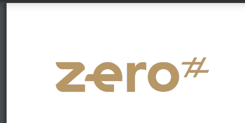
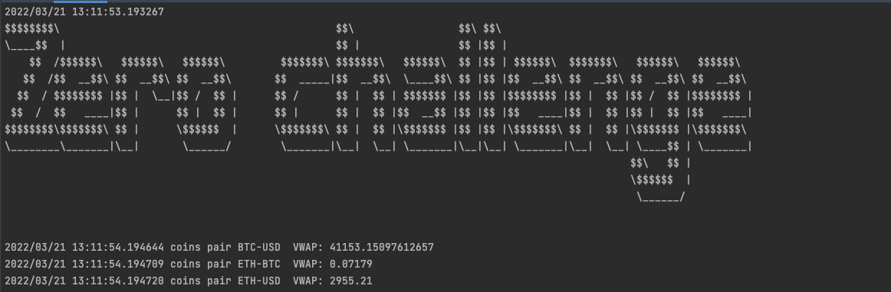

# Overview
Zero apps is an app for trading users. It gives you the average price security has traded at throughout the day, based on both volume and price in real-time.
In this app you'll get all the information without the noise that occurs throughout the day, you are going to get real data from the coinbase platform.

Zero app uses a client WebSocket to connect to coinbase, you can set up the pair coins that you want to trade, also the number of data points

### Setup:

- Create a .env file and add the follow:
~~~bash
# Pair of coins (you can place the ones you want) without spaces
TRADING_PAIR=BTC-USD,ETH-USD,ETH-BTC
# url of websocket coinbase
BROKER_URL=wss://ws-feed.exchange.coinbase.com
# max size of a sliding window
MAX_SIZE=200
~~~

- Run follow command:
~~~bash
make setup
~~~

### Run app

- run the follow command:
~~~bash
make run
~~~

### Testing

~~~bash
make test
~~~